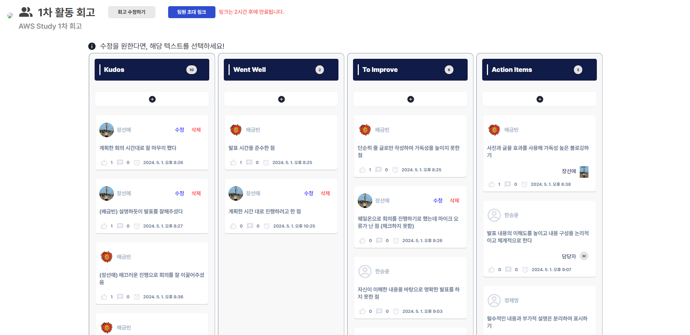
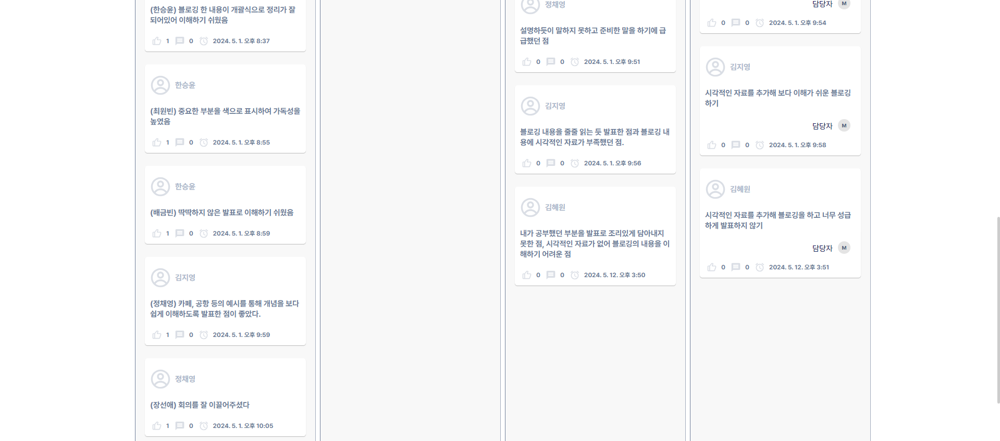
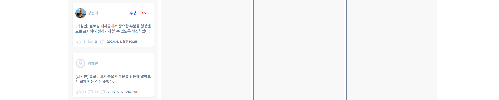

# 2024-AWS-study
Learning Cloud Technologies through AWS

- [⭐스터디 노션 관리 페이지](https://auspicious-voyage-835.notion.site/2024-AWS-Study-874092e730bc465f8f0ed1160ad5822e?pvs=4)
- [스터디 개요 확인-wiki](https://github.com/seonae-j/2024-AWS-study/wiki/Summary)
- [AWS 자격증 학습율 확인](https://auspicious-voyage-835.notion.site/b4442be3f13d44d9abcbb3f8360413a1?v=cac27fac85544232bb0ec8871a1153cb&pvs=4)

## 스터디 규칙
- 스터디 끝날 때 참석율 + 과제 완료율을 합쳐서 1등인 사람에게 치킨 기프티콘 (+a 생각중)
- 시험 기간 동안은 스터디 활동 중단
- [스터디 참여율 계산법](https://auspicious-voyage-835.notion.site/a055ace3e4ac4b049a0447634340c7c4?pvs=4)

# 스터디 진행 내용

## 0. OT - 04/10 (수) 19:00
모임 자료 : [OT](https://auspicious-voyage-835.notion.site/OT-04-10-19-00-e040c4ca11a9474a8fd4c037b6d48ef9?pvs=4)

참석자 : 장선애, 김지영, 정채영, 김혜원, 한승윤, 배금빈, 최원빈 + 도현님

## 1. 1차- 05/01 (수) 19:00
모임 자료 : [1차 정기 모임](https://auspicious-voyage-835.notion.site/1-c8de6db5f74b4721bd0f0718e815acf2?pvs=4)

참석자 : 장선애, 김지영, 정채영, 김혜원, 한승윤, 배금빈, 최원빈

발표 자료 (AWS 기본 내용 모듈 중 1개 지정해서 블로깅 후 짧게 발표)
- [장선애-S3](https://sundery.tistory.com/91)
- [김지영-EC2](https://jyxung.tistory.com/2)
- [정채영-Networking](https://lu-cia.tistory.com/2)
- [김혜원-모듈 5 전체](https://hyeoni-study.tistory.com/2)
- [한승윤-EC2 요금](https://seungyoon1786.tistory.com/4)
- [배금빈-모듈 3 고가용성, 리전 개요](https://blog.naver.com/binny1204/223433185189)
- [최원빈-웹 서비스](https://worsing12.tistory.com/11)

### 1-1. 1차 활동 회고

## 2. 2차- 05/08 (수) 19:00
참석자 : 장선애, 김지영, 정채영, 김혜원, 한승윤, 배금빈, 최원빈

발표자 : 한승윤(Storage), 정채영(Security)
- [Storage 발표자료](https://seungyoon1786.tistory.com/6), [Storage 발표영상](https://drive.google.com/file/d/1x4jctGbZ61fND50Wy9rJ6AlEVtQS_5l1/view?usp=sharing)
- [Security 발표자료](https://lu-cia.tistory.com/5), [Security 발표영상](https://drive.google.com/file/d/1WysV9OK8pEhdRuDWfOpn8okfCOPWIXV7/view?usp=sharing)

## 3. 3차- 05/15 (수) 19:00
모임 자료 : [3차 정기 모임](https://auspicious-voyage-835.notion.site/1-c8de6db5f74b4721bd0f0718e815acf2?pvs=4)

참석자 : 장선애, 김지영, 정채영, 김혜원, 한승윤, 배금빈, 최원빈

- AWS Skillbuilder 구독 및 피드백을 위한 사전안내
- AWS Skillbuilder 구독하기 

## 4. 4차- 05/22 (수) 19:00
모임 자료 : [4차 정기 모임](https://auspicious-voyage-835.notion.site/4-55bf39d20b75484da1fcd14149ccc83a?pvs=4)

참석자 : 장선애, 김지영, 정채영, 김혜원, 한승윤, 배금빈, 최원빈

- Skillbuilder 사용 장/단점 공유
- Skillbuilder와 Educate와의 차이점 의견 공유

## 5. 5차- 05/29 (수) 19:00
참석자 : 장선애, 김지영, 정채영, 김혜원, 한승윤, 배금빈, 최원빈

발표자 : 최원빈(Compute), 김혜원(Databases)
- [Compute 발표자료](https://worsing12.tistory.com/13), [Compute 발표영상](https://drive.google.com/file/d/1L_jtisqmFAJ8O6D1KPjktpnq9SdSf3wM/view?usp=sharing)
- [Databases 발표자료](https://hyeoni-study.tistory.com/9), [Databases 발표영상](https://drive.google.com/file/d/18GbDnI14LR8JCOmblEiLEU9H1Lw7ya8r/view?usp=sharing)

## 6. 6차- 06/05 (수) 19:00
참석자 : 장선애, 김지영, 정채영, 김혜원, 한승윤, 배금빈

발표자 : 장선애(Networking), 김지영(Cloud Operations), 배금빈(Serverless)
- [Networking 발표자료](https://sundery.tistory.com/96), [Networking 발표영상](https://drive.google.com/file/d/1VkAhUUxA2cT19R9-5X60lnGFGPQaZbXj/view?usp=drive_link)
- [Cloud Operations 발표자료](https://jyxung.tistory.com/7), [Cloud Operations 발표영상](https://drive.google.com/file/d/1pvrH8m41OyPNC5XxS5RFFGPpoe2MGoO-/view?usp=drive_link)
- [Serverless 발표자료](https://geumbin1204.notion.site/7-6b17b345183344b3b6a62b09b595700a), [Serverless 발표영상](https://drive.google.com/file/d/1itvWZ9qf9N4WiIXRe1EJrzib0T5BozT5/view?usp=drive_link)

## 7. 7차- 06/26 (수) 19:00
모임 자료 : [7차 정기 모임](https://auspicious-voyage-835.notion.site/7-a4f5de79758b4ad7b2778ca06ebe4e90?pvs=4)

참석자 : 장선애, 김지영, 김혜원, 한승윤, 배금빈

- 앞으로 Study의 진행 방향
- Udemy 강의를 통한 자격증 스터디 방향
- 발표를 진행할 수 있는 실습 콘텐츠 지정 설명

## 8. 8차- 07/03 (수) 19:00
참석자 : 장선애, 최원빈, 한승윤, 배금빈

- AWS 자격증 유데미 공부
- 디스코드 화면공유를 통한 공부현황 공유
- 
## 9. 9차- 07/10 (수) 19:00
참석자 : 장선애, 최원빈, 한승윤, 배금빈, 김지영

- AWS 자격증 유데미 공부
- 디스코드 화면공유를 통한 공부현황 공유
- 전체적인 스터디 이후 콘텐츠 방향성 전달
